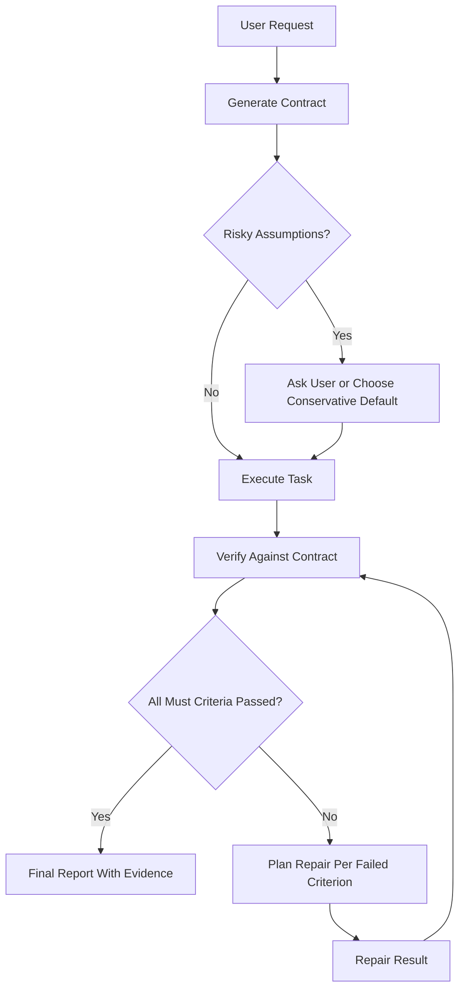

# Contract-First Agentic Design Pattern

## 개요

**Contract-First Agentic Design Pattern**은 에이전트가 작업을 바로 실행하지 않고, 먼저 검증 가능한 완료 계약을 만든 뒤 그 계약을 통과할 때까지 실행, 검증, 수리를 반복하는 디자인패턴이다.

핵심은 계획을 먼저 세우는 것이 아니라 **완료의 정의를 먼저 고정하는 것**이다. 이 계약은 이후 에이전트의 실행 결과를 평가하는 기준이 된다.

## 최종 한 문장

> Contract-First는 에이전트가 먼저 답을 내는 대신, 스스로 검증 가능한 완료 계약을 만들고 그 계약을 만족할 때까지 행동을 조정하는 패턴이다.

## 왜 필요한가

LLM 기반 에이전트는 빠르게 결과물을 만들 수 있지만, 바로 실행하는 방식에는 약점이 있다.

- 사용자의 완료 기준과 에이전트의 완료 기준이 다를 수 있다.
- 결과가 그럴듯해 보여도 필수 조건을 빠뜨릴 수 있다.
- 긴 작업에서 목표가 흔들리고 이전 요구사항이 깨질 수 있다.
- 검증이 마지막에 붙는 부가 작업처럼 취급될 수 있다.
- 실패했을 때 무엇을 고쳐야 하는지 기준별로 분해되지 않는다.

Contract-First는 작업 시작 전에 “끝났다고 말할 수 있는 조건”을 구조화해서 이 문제를 줄인다.

## 핵심 흐름

```text
User Request
-> Contract Generator
-> Assumption Gate
-> Executor
-> Verifier
-> Repair Planner
-> Repair Executor
-> Final Reporter
```



## 기존 패턴과의 차별점

| 기존 접근 | 핵심 | 한계 | Contract-First의 보완 |
|---|---|---|---|
| Plan-and-Execute | 작업 순서를 먼저 만든다. | 계획은 있어도 완료 기준이 약할 수 있다. | 계획보다 먼저 수용 기준과 검증법을 만든다. |
| ReAct | 생각, 행동, 관찰을 반복한다. | 관찰 결과를 어떤 기준으로 성공 판정할지 모호할 수 있다. | 관찰 결과를 계약 기준에 매핑한다. |
| Reflexion | 실패 후 자기반성을 수행한다. | 반성의 품질이 주관적일 수 있다. | 실패한 계약 항목만 대상으로 수리한다. |
| TDD Agent | 테스트를 먼저 만든다. | 코드 작업에는 강하지만 문서, 분석, 도구 실행에는 좁을 수 있다. | 테스트뿐 아니라 가정, 범위, 위험, 증거까지 계약으로 다룬다. |

## 계약의 필수 요소

계약은 최소한 다음 요소를 가진다.

- `goal`: 최종 목표
- `scope`: 이번 작업에 포함되는 범위
- `out_of_scope`: 이번 작업에서 제외되는 범위
- `assumptions`: 확인되었거나 보수적으로 둔 가정
- `acceptance_criteria`: 수용 기준 목록
- `priority`: `must`, `should`, `could` 중 하나
- `verification`: 기준을 검증하는 방법
- `evidence`: 성공/실패 판단에 사용할 증거
- `failure_policy`: 완료 판정 규칙
- `repair_policy`: 실패 기준 수리 규칙

정식 스키마는 [contract_schema.json](C:/Users/hno13/Documents/Codex/2026-06-19/ai-agentic-design-pattern/outputs/contract_first_agent_pattern/contract_schema.json)에 있다.

## 알고리즘

```text
function contract_first_agent(request):
    contract = generate_contract(request)
    contract = resolve_risky_assumptions(contract)
    result = execute(request, contract)

    for attempt in 1..max_iterations:
        verification = verify(result, contract)

        if all_must_criteria_passed(verification):
            return final_report(result, contract, verification)

        repair_plan = plan_repairs(verification.failed_criteria)
        result = repair(result, contract, repair_plan)

    return final_report_with_remaining_failures(result, contract, verification)
```

## 데모 실행

```powershell
python .\outputs\contract_first_agent_pattern\contract_first_demo.py
```

옵션을 지정할 수도 있다.

```powershell
python .\outputs\contract_first_agent_pattern\contract_first_demo.py --request "CSV 월별 매출 요약 스크립트를 만들어줘" --run-dir .\outputs\contract_first_agent_pattern\demo_run
```

패키지 자체 검수:

```powershell
python .\outputs\contract_first_agent_pattern\validate_package.py
```

## 데모가 보여주는 것

1. 사용자 요청을 구조화된 계약으로 변환한다.
2. 첫 번째 구현을 생성한다.
3. 계약 기준별로 검증한다.
4. 실패한 기준만 뽑아 수리 계획을 만든다.
5. 두 번째 구현에서 실패 기준을 수정한다.
6. 모든 `must` 기준이 통과하면 최종 리포트를 생성한다.

## 주요 산출물

| 파일 | 설명 |
|---|---|
| [FINAL_BRIEFING.md](C:/Users/hno13/Documents/Codex/2026-06-19/ai-agentic-design-pattern/outputs/contract_first_agent_pattern/FINAL_BRIEFING.md) | 최종 제출용 브리핑 |
| [PATTERN_SPEC.md](C:/Users/hno13/Documents/Codex/2026-06-19/ai-agentic-design-pattern/outputs/contract_first_agent_pattern/PATTERN_SPEC.md) | 정식 패턴 명세 |
| [IMPLEMENTATION_GUIDE.md](C:/Users/hno13/Documents/Codex/2026-06-19/ai-agentic-design-pattern/outputs/contract_first_agent_pattern/IMPLEMENTATION_GUIDE.md) | 구현 가이드 |
| [PROMPT_TEMPLATES.md](C:/Users/hno13/Documents/Codex/2026-06-19/ai-agentic-design-pattern/outputs/contract_first_agent_pattern/PROMPT_TEMPLATES.md) | LLM 에이전트 적용용 프롬프트 템플릿 |
| [contract_schema.json](C:/Users/hno13/Documents/Codex/2026-06-19/ai-agentic-design-pattern/outputs/contract_first_agent_pattern/contract_schema.json) | 계약 JSON 스키마 |
| [contract_first_demo.py](C:/Users/hno13/Documents/Codex/2026-06-19/ai-agentic-design-pattern/outputs/contract_first_agent_pattern/contract_first_demo.py) | 실행 가능한 데모 |
| [validate_package.py](C:/Users/hno13/Documents/Codex/2026-06-19/ai-agentic-design-pattern/outputs/contract_first_agent_pattern/validate_package.py) | 전체 산출물 자체 검수 스크립트 |

## 적용하기 좋은 경우

- 코드 생성, 데이터 분석, 문서 변환처럼 검증 가능한 작업
- 도구 실행이 많고 실패 비용이 있는 에이전트 워크플로우
- 장기 작업에서 목표 이탈을 줄여야 하는 경우
- 사람이 모든 중간 결과를 확인하기 어려운 자동화

## 피하는 것이 좋은 경우

- 아주 짧은 질의응답처럼 계약 생성 비용이 더 큰 경우
- 순수 창작처럼 기준을 과하게 고정하면 결과가 빈약해지는 경우
- 외부 상태가 너무 빨리 변해서 계약 자체가 금방 낡는 경우

## 완성 상태

현재 데모는 6개의 `must` 수용 기준을 사용한다. 첫 번째 구현은 일부 기준을 실패하고, 수리 계획 생성 후 두 번째 구현에서 모든 기준을 통과한다. 검증 결과와 최종 리포트는 `demo_run` 폴더에 재현 가능하게 생성된다.
